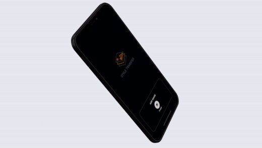
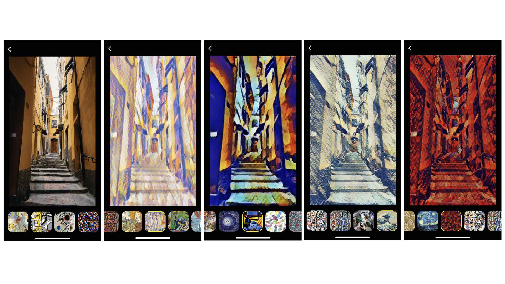
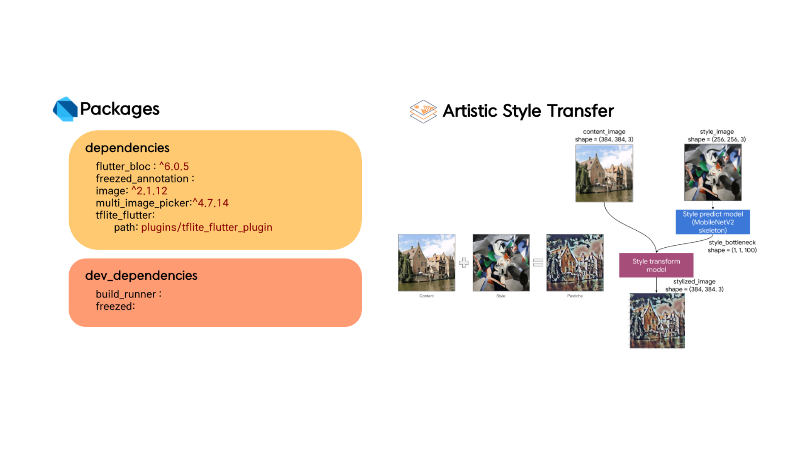
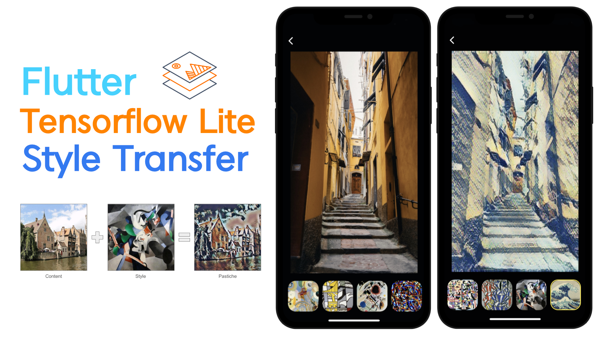

# Flutter Tensorflow Lite Style Transfer

Artistic Style Transfer with TensorFlow Lite

 

 

 

## Youtube
[Flutter TensorFlow Lite Style Transfer - Speed Code](https://youtu.be/Qsqtb1mUguY)

 

## Reference
* About Style Transfer : https://www.tensorflow.org/lite/models/style_transfer/overview

## Packages
* flutter_bloc : https://pub.dev/packages/flutter_bloc

* freezed : https://pub.dev/packages/freezed

* freezed_annotation : https://pub.dev/packages/freezed_annotation

* build_runner : https://pub.dev/packages/build_runner

* image : https://pub.dev/packages/image

* multi_image_picker : https://pub.dev/packages/multi_image_picker

* tflite_flutter : https://pub.dev/packages/tflite_flutter    
(The plug-in has a problem with iOS 14 and has been downloaded locally.)
